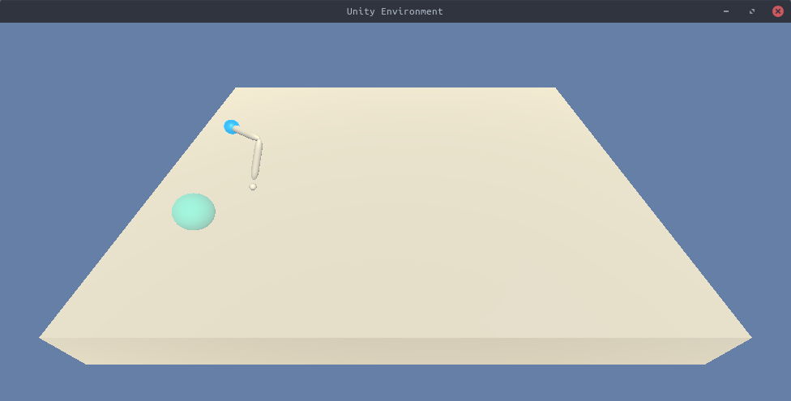

# continuous-control-ddpg
Continuous Control Project - DDPG

## Project Details

In this environment, a double-jointed arm can move to target locations. A reward of +0.1 is provided for each step that the agent's hand is in the goal location. Thus, our agent's goal is to maintain its position at the target location for as many time steps as possible.

The observation space consists of 33 variables corresponding to position, rotation, velocity, and angular velocities of the arm. Each action is a vector with four numbers, corresponding to torque applicable to two joints. Every entry in the action vector should be a number between -1 and 1.

Teh environment is sovelved when the agent gets an average score of +30 over 100 consecutive episodes.

## Getting Started

1. Visit the following link for instructions on how to set up your environment: [instructions](https://github.com/udacity/deep-reinforcement-learning#dependencies)
2. Run `pip install -r requirements.txt`, using the virtual environment created in the previous step, to install the remaining of the required dependencies.

3. The environment included in this repository is for the Linux platform only. See
below for environments for other platforms:
  * Mac OSX: [click here](https://s3-us-west-1.amazonaws.com/udacity-drlnd/P2/Reacher/one_agent/Reacher.app.zip)
  * Windows (32-bit): [click here](https://s3-us-west-1.amazonaws.com/udacity-drlnd/P2/Reacher/one_agent/Reacher_Windows_x86.zip)
  * Windows (64-bit): [click here](https://s3-us-west-1.amazonaws.com/udacity-drlnd/P2/Reacher/one_agent/Reacher_Windows_x86_64.zip)

## Instructions

- Once the requirements detailed above are satisfied run the following command to
train the Agent:\
`python ddpg.py`
- To run the Agent in eval mode we need to pass the checkpoint files as a CLI argument.
- Run the following command for further details:\
`python ddpg.py -h`
